**By T. A. Driscoll and R. J. Braun.**

:::{layout-ncol="2"}
* **Free online** at [fncbook.com](https://fncbook.com).
* **Buy in print** at the SIAM bookstore [for MATLAB](https://epubs.siam.org/doi/10.1137/1.9781611975086) or [for Julia](https://epubs.siam.org/doi/10.1137/1.9781611977011). Members of SIAM, including [student members](http://siam.org/students/memberships.php), get a 30% discount. 

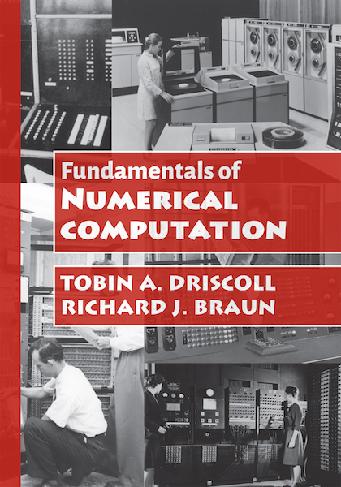{width=120 alt="FNC cover" .preview-image}
:::

This textbook is designed to introduce undergraduates in math, computer science, engineering, and related fields to the principles and practice of numerical computation. Our approach emphasizes linear algebra and approximation. The text presents mathematical underpinnings and analysis, complemented with 45 functions and over 160 examples coded in Julia, MATLAB, and Python. Previous experience in Julia/MATLAB/NumPy/SciPy is not required. 

The text is organized to be useful for either a one-semester introduction or two-semester sequence, with the most advanced techniques and concepts appearing in the second half of the book. 

Please note the [known errata](https://github.com/tobydriscoll/fnc-extras/blob/master/errata/errata.md) for the original print edition.

### Resources

The book's functions are available in three programming languages:

- [FNCFunctions.jl for Julia](https://github.com/fncbook/FNCFunctions.jl)
- [FNC-matlab toolbox for MATLAB](https://github.com/fncbook/FNC-matlab?tab=readme-ov-file#fnc-matlab)
- [fncbook for Python](https://pypi.org/project/fncbook/)

::: {layout-ncol="4"}
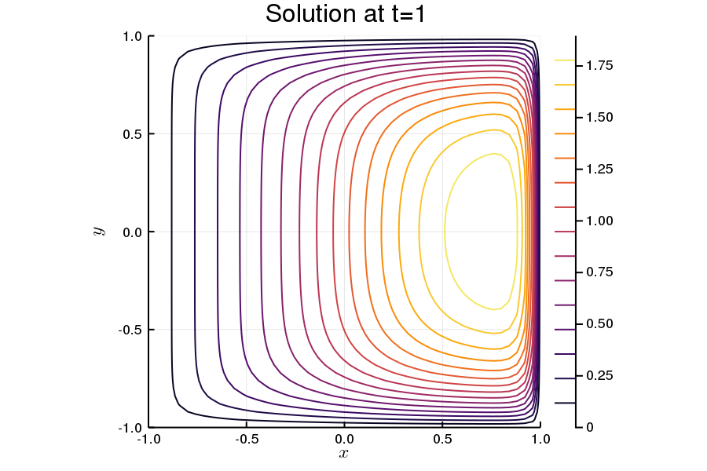{group="fnc"}

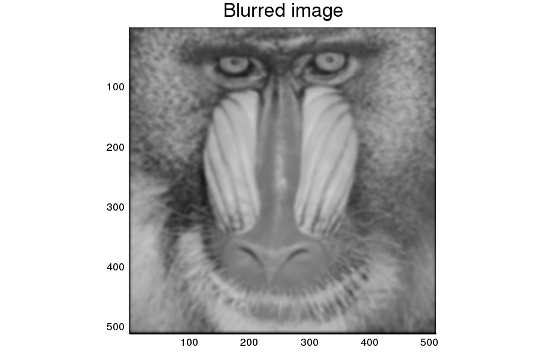{group="fnc"}

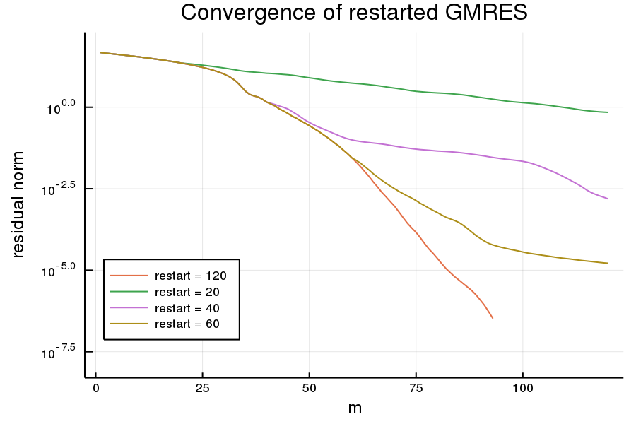{group="fnc"}

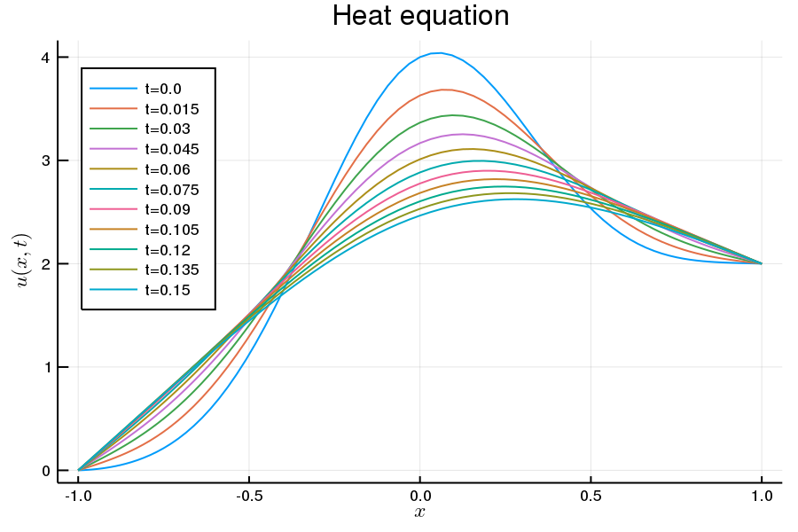{group="fnc"}

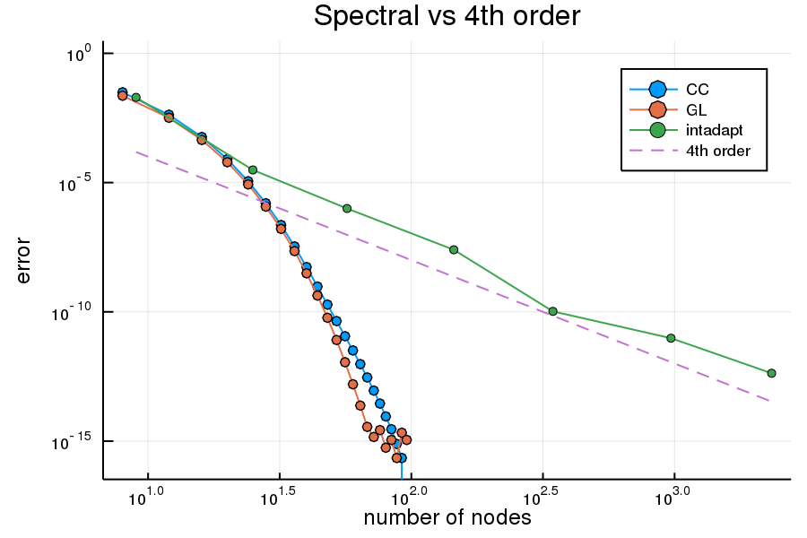{group="fnc"}

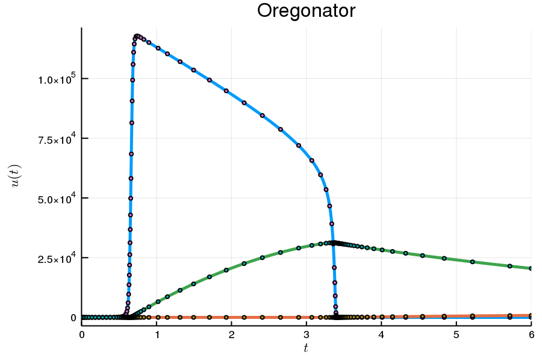{group="fnc"}

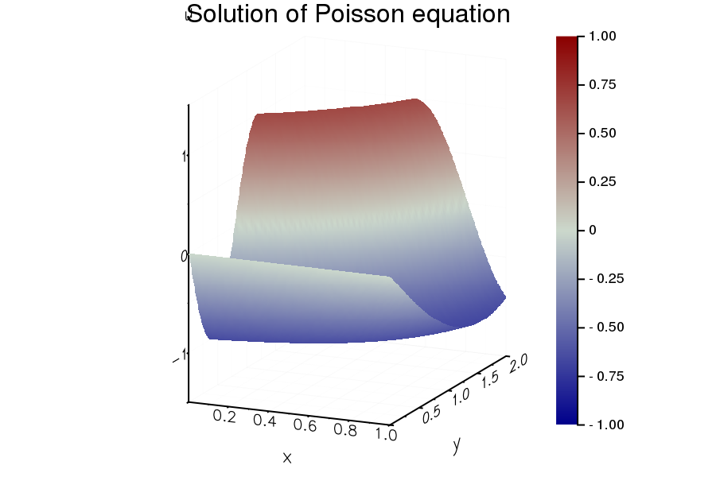{group="fnc"}

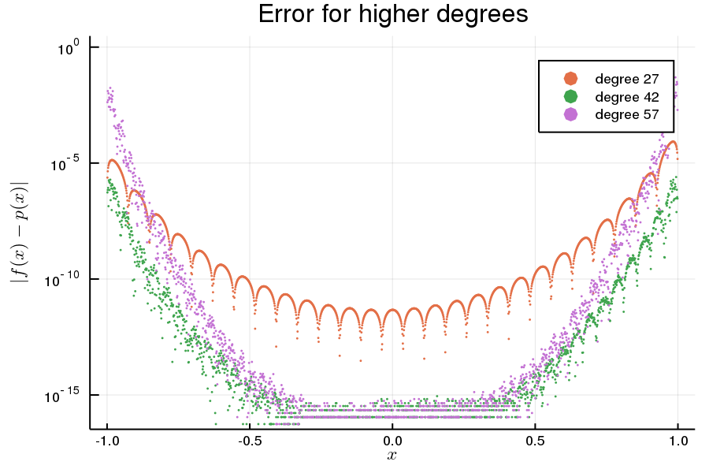{group="fnc"}

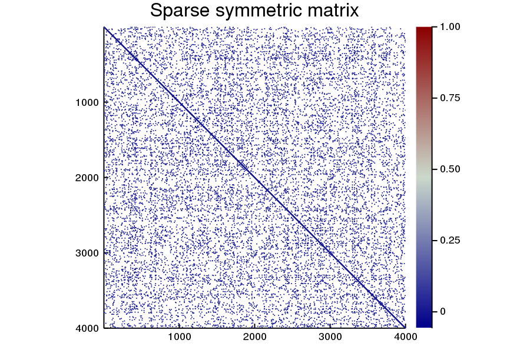{group="fnc"}

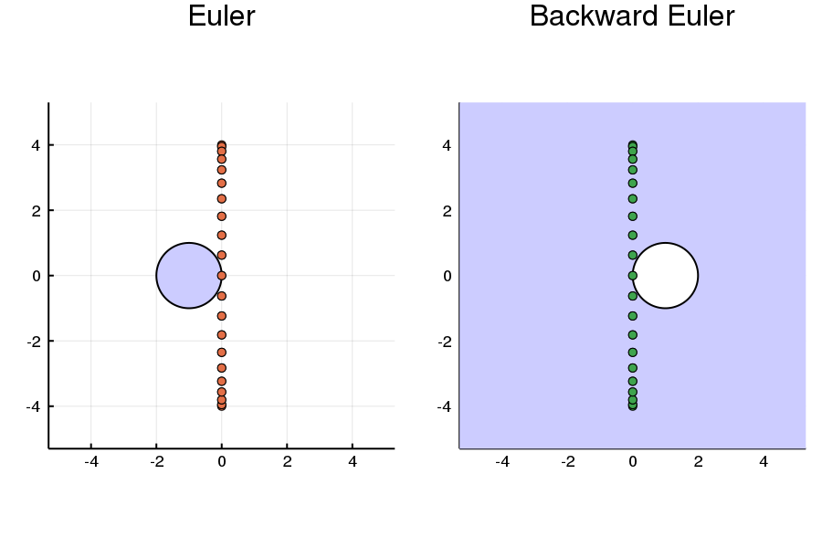{group="fnc"}

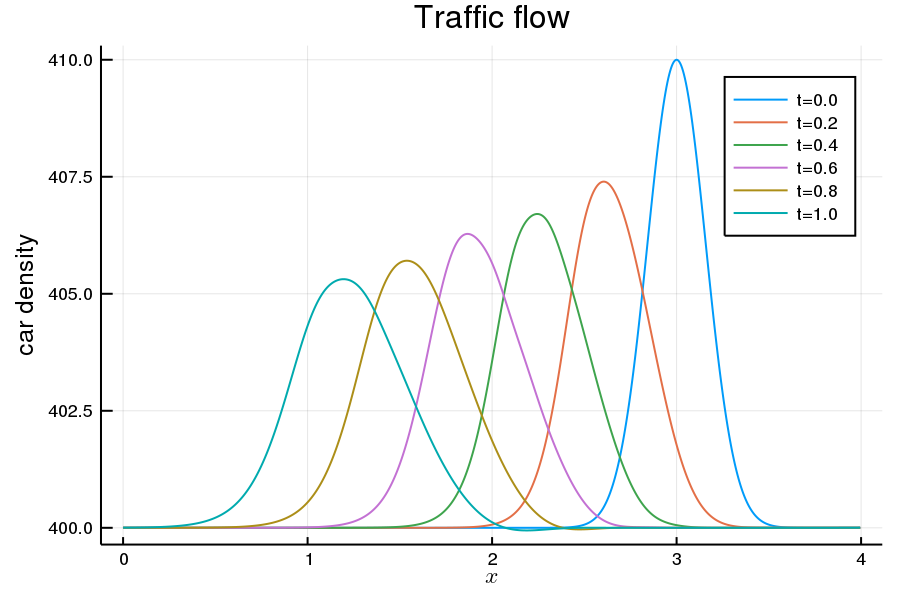{group="fnc"}

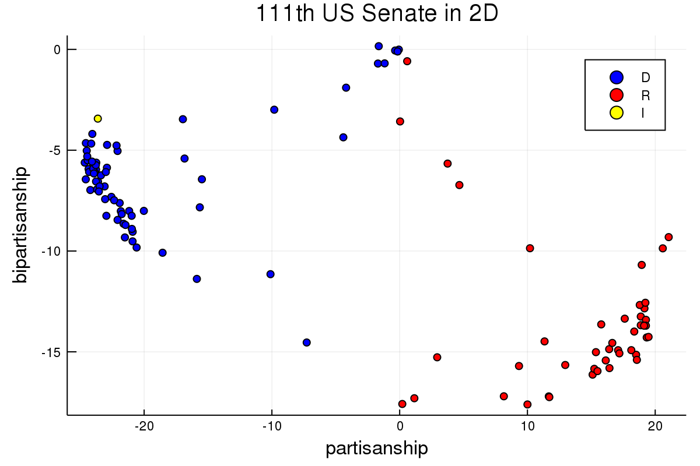{group="fnc"}
:::

### Contents

1. Numbers, problems, and algorithms
	1. Floating point numbers
	1. Problems and conditioning
	1. Stability of algorithms
1. Square linear systems
	1. Polynomial interpolation
	1. Computing with matrices
	1. Linear systems
	1. LU factorization
	1. Efficiency of matrix computations
	1. Row pivoting
	1. Vector and matrix norms
	1. Conditioning of linear systems
	1. Exploiting matrix structure
1. Overdetermined linear systems
	1. Fitting functions to data
	1. The normal equations
	1. The QR factorization
	1. Computing QR factorizations
1. Roots of nonlinear equations
	1. The rootfinding problem
	1. Fixed point iteration
	1. Newton's method in one variable
	1. Interpolation-based methods
	1. Newton for nonlinear systems
	1. Quasi-Newton methods
	1. Nonlinear least squares
1. Piecewise interpolation and calculus
	1. The interpolation problem
	1. Piecewise linear interpolation
	1. Cubic splines
	1. Finite differences
	1. Convergence of finite differences
	1. Numerical integration
	1. Adaptive integration
1. Initial-value problems for ODEs
	1. Basics of IVPs
	2. Euler's method
	3. Systems of differential equations
	4. Runge-Kutta methods
	5. Adaptive Runge-Kutta
	6. Multistep methods
	7. Implementation of multistep methods
	8. Zero-stability of multistep methods
1. Matrix analysis
	1. From matrix to insight
	1. Eigenvalue decomposition
	1. Singular value decomposition
	1. Symmetry and definiteness
	1. Dimension reduction
1. Krylov methods in linear algebra
	1. Sparsity and structure
	1. Power iteration
	1. Inverse iteration
	1. Krylov subspaces
	1. GMRES
	1. MINRES and conjugate gradients
	1. Matrix-free iterations
	1. Preconditioning
1. Global function approximation
	1. Polynomial interpolation
	1. The barycentric formula
	1. Stability of polynomial interpolation
	1. Orthogonal polynomials
	1. Trigonometric interpolation
	1. Spectrally accurate integration
	1. Improper integrals
1. Boundary-value problems
	1. Shooting
	1. Differentiation matrices
	1. Collocation for linear problems
	1. Nonlinearity and boundary conditions
	1. The Galerkin method
1. Diffusion equations
	1. Black-Scholes equation
	1. The method of lines
	1. Absolute stability
	1. Stiffness
	1. Method of lines for parabolic PDEs
1. Advection equations
	1. Traffic flow
	1. Upwinding and stability
	1. Absolute stability for advection
	1. The wave equation
1. Two-dimensional problems
	1. Tensor-product discretizations
	1. Two-dimensional diffusion and advection
	1. Laplace and Poisson equations
	1. Nonlinear elliptic PDEs

